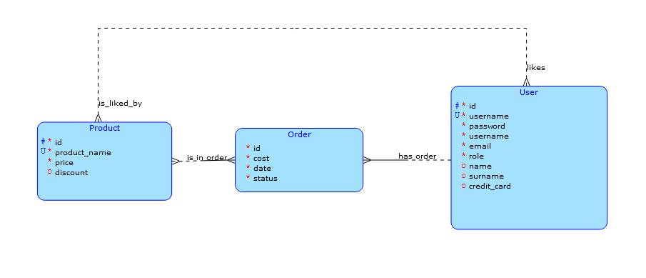

# Music Store

A three-layered REST application built with the newest version of Spring using Gradle as a builder and PostgreSQL as the database. The application consists of a web client that uses Thymeleaf and Spring Web, and a server that uses JPA.

## Features
- User registration and authentication
- Create and manage orders
- See liked products
- Add tracks to a shopping cart
- Purchase tracks
- Show order that are important to ship off
- Manage users

## Business operation
This is an operation that uses multiple decision makings on the client side and JPQL query on the server side it will extract all orders from the database that are either "Waiting" or "Preparing", these are important because it is stores matter to prepare them for shipment, they will be sorted to three categories
- Very Imporant - these are "Waiting" for more than 4 days 
- Important - these are "Waiting" for more than 2 days or "Preparing" for more than 4 days
- Not Important - anything less than

## Documentation 

You are able to see API documentation for HTTP requests and Entity details on http://localhost:8080/swagger-ui/index.html#/ once the server is running

## Model of entities

## Getting Started

### Prerequisites
- Java 8 or higher
- Gradle 6 or higher
- PostgreSQL 12 or higher

### Installation
1. Clone the repository: `git clone https://github.com/your-username/music-store.git`
2. Navigate to the project directory: `cd music-store`
3. Build the project: `gradle build`
4. Create a PostgreSQL database and configure the database connection settings in `src/main/resources/application.properties`
5. Run the project: `gradle bootRun`
6. Visit `http://localhost:8080` in your web browser to access the application

### Usage
- Register an account or use the following credentials to log in as an administrator:
  - Email: `admin@example.com`
  - Password: `password`
- Browse and search for music tracks
- Add tracks to your shopping cart
- Checkout and purchase tracks

## Built With
- [Spring](https://spring.io/) - The web framework used
- [Gradle](https://gradle.org/) - Dependency Management
- [PostgreSQL](https://www.postgresql.org/) - Database
- [Thymeleaf](https://www.thymeleaf.org/) - Templates engine for web client
- [Docker](https://www.docker.com/) - OS-level virtualization to deliver software

## Authors
- [Matěj Schrödl](https://github.com/schrodlm)

## License
This project is licensed under the MIT License - see the [LICENSE](LICENSE) file for details.

## Acknowledgments
- Hat tip to anyone whose code was used
